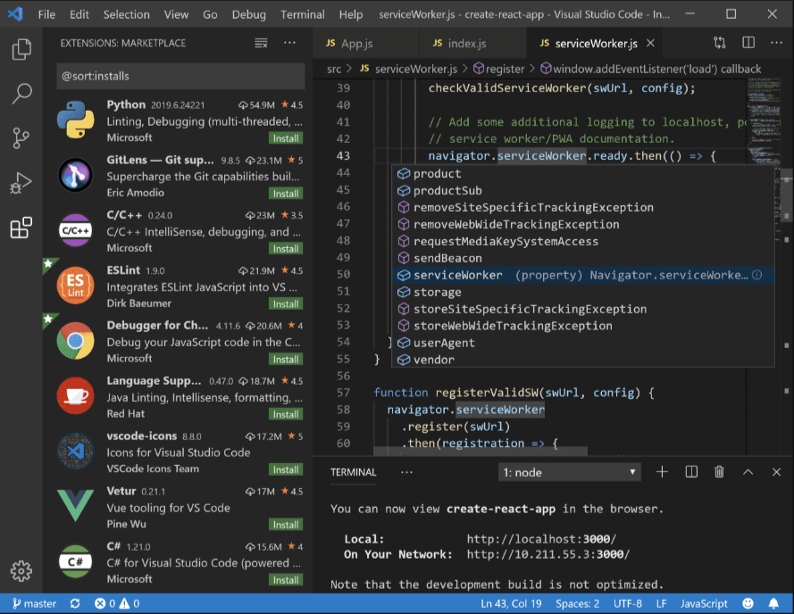

## 什么是 Electron?

### 一、Electron 是什么

> Electron 是一个使用 JavaScript、HTML 和 CSS 构建桌面应用程序的框架。 嵌入 Chromium 和 Node.js 到 二进制的 Electron 允许您保持一个 JavaScript 代码代码库并创建 在 Windows 上运行的跨平台应用 macOS 和 Linux——不需要本地开发 经验。

### 二、大白话

Electron 是一个前端框架，可用于构建跨平台的桌面应用程序.从现在开始 ,前端技术也可用于桌面应用程序的开发。开发者可使用 JavaScript、HTML 和 CSS 等前端基础技术，结合 Node.js 进行开发。最重要的是，使用 Electron 开发的桌面应用程序，可以在 Windows、macOS 和 Linux 系统上无缝运行，实现跨平台开发。

说白了，就是我们使用前端技术写个 Web 应用，然后套上 Electron 这个外套，就变成了桌面应用程序。

## Electron 有哪些应用?

- [apifox](https://apifox.com/?utm_source=baidu_pinzhuan&utm_medium=sem&utm_campaign=pinzhuan&utm_content=pinzhuan&utm_term=apifox)
- [阿里云网盘](https://www.alipan.com/)
- [bilibili 客户端](https://app.bilibili.com/)
- [抖音客户端](https://www.douyin.com/vs)
- [优酷客户端](https://mobile.youku.com/)
- [postman](https://www.postman.com/downloads/)

## **Electron 的优势与挑战**

Electron 框架的优势在于它允许开发者使用熟悉的 Web 技术（JavaScript、HTML 和 CSS）来开发桌面应用程序，降低了开发难度和成本。同时，Electron 提供了丰富的 API 和[文档](https://cloud.baidu.com/product/doc.html)资源，使得开发者可以轻松地实现各种功能。然而，Electron 框架也面临一些挑战，如应用程序包体积较大、性能优化等问题。
