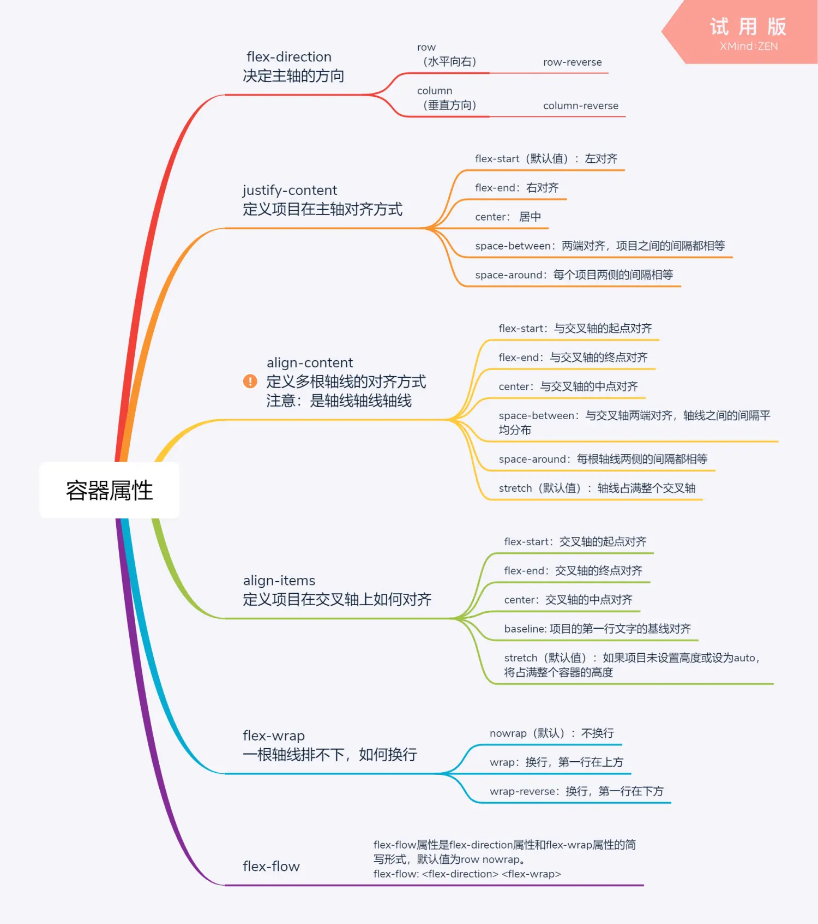
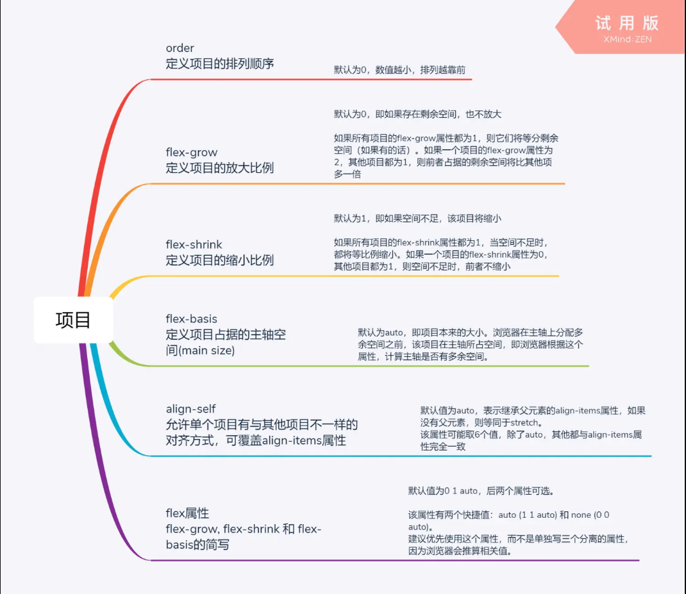
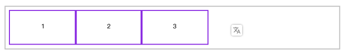

弹弹弹

## 前言

布局的传统解决方案，基于盒状模型，依赖 display 属性 + position 属性 + float 属性。它对于那些特殊布局非常不方便，比如，垂直居中就不容易实现。

2009 年，W3C 提出了一种新的方案—— Flex 布局，可以简便、完整、响应式地实现各种页面布局。目前，它已经得到了所有浏览器的支持，这意味着，现在就能很安全地使用这项功能。

## 什么是Flex弹性布局?

Flex 是 Flexible Box 的缩写，意为"弹性布局"，用来为盒状模型提供最大的灵活性。

CSS3 弹性盒（ Flexible Box 或 flexbox），是一种当页面需要适应不同的屏幕大小以及设备类型时确保元素拥有恰当的行为的布局方式。

引入弹性盒布局模型的目的是提供一种更加有效的方式来对一个容器中的子元素进行排列、对齐和分配空白空间。





## 声明Flex容器

容器盒子里面包含着容器元素，使用 `display:flex` 或 `display:inline-flex` 声明为弹性盒子。

**需要注意的是：当时设置 flex 布局之后，子元素的 float、clear、vertical-align 的属性将会失效。**

```html
<style>
  * {
    padding: 0;
    margin: 0;
  }
  article {
    height: 150px;
    margin-left: 100px;
    margin-top: 100px;
    outline: solid 5px silver;
    display: flex;
    padding: 20px;
  }
  article div {
    outline: solid 5px blueviolet;
    text-align: center;
    font-size: 28px;
    line-height: 5em;
    width: 300px;
  }
</style>
...

<article>
  <div>1</div>
	<div>2</div>
	<div>3</div>
</article>
```

