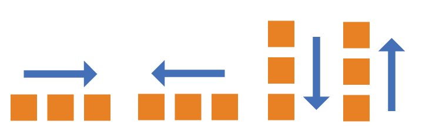
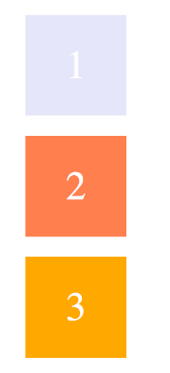
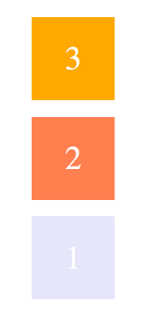

### flex-direction

`flex-direction` **用于控制主轴的方向**

```css
.container {
    flex-direction: row | row-reverse | column | column-reverse;
}
```


| 值             | 描述                       |
| :------------- | :------------------------- |
| row            | 主轴为水平方向，起点在左端 |
| row-reverse    | 主轴为水平方向，起点在右端 |
| column         | 主轴为垂直方向，起点在上沿 |
| column-reverse | 主轴为垂直方向，起点在下沿 |



## row


## row-reverse


## column



## column-reverse

