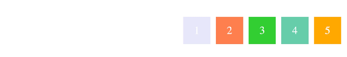
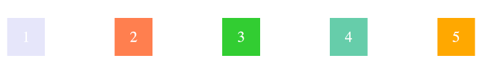
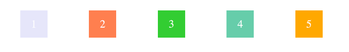
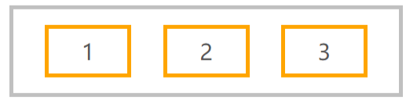

# justify-content

```css
.container {
    justify-content: flex-start | flex-end | center | space-between | space-around;
}
```


## flex-start

默认值,左对齐


## flex-end

右对齐



## center

居中


## space-between

物品均匀分布在行中；第一项在起始行，最后一项在结束行



## space-around

项目均匀分布在行中，周围空间相等。请注意，视觉上的空间是不相等的，因为所有项目的两边都有相等的空间。第一个项目将在容器边缘有一个空间单位，但下一个项目之间有两个空间单位，因为下一个项目有自己的适用间距。



## space-evenly

项目分布使得任何两个项目之间的间距（以及边缘的空间）相等

