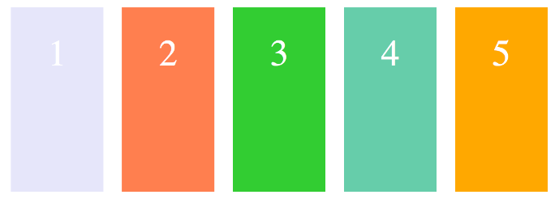
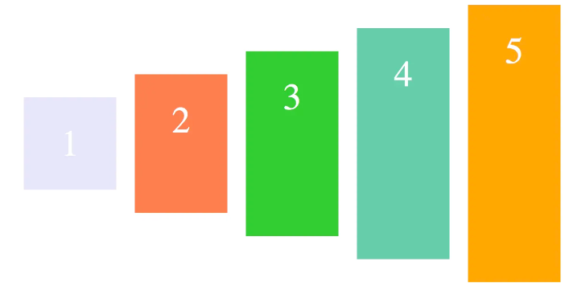
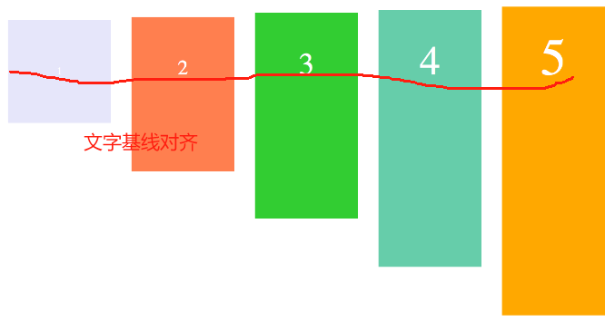

# align-items

```css
.container {
    align-items: flex-start | flex-end | center | baseline | stretch;
}
```

> 针对只有单行的情况

## stretch 

如果项目未设置高度或者值为auto 那么它的高度就是容器高度



## flex-start

设置为交叉轴的起点


## flex-end

交叉轴终点对齐方式


## center

居中对齐



## baseline

文字基线对齐

