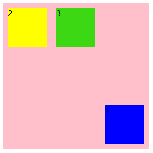

> 一直都是flex布局走天下 但是某些地方还是比较麻烦

使用` display: grid`  声明一个网格容器 

使用 `display: inline-grid`声明一个行级的网格容器

```html
<!DOCTYPE html>
<html lang="en">
<head>
    <meta charset="UTF-8">
    <meta name="viewport" content="width=device-width, initial-scale=1.0">
    <title>Document</title>
    <style>
        *{
            background-clip: content-box;
            box-sizing: border-box;
        }
        #gird {
            background-color: pink;
            display: grid;
            width: 300px;
        }
   
    </style>
</head>
<body>
    <div id="gird">
        <div>1</div>
        <div>2</div>
        <div>3</div>
    </div>
    </div>
</body>
</html>
```


