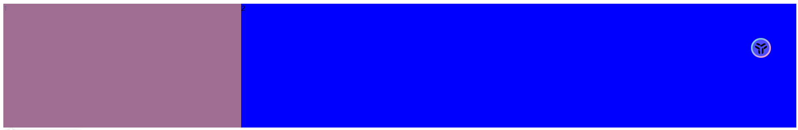

> 盖房子只有一个空壳可不行

## 划分行列

```css
grid-template-rows: 100px 100px 100px;
grid-template-columns: 100px 100px 100px;
```

使用 `grid-template-rows` 划分网格的行数 设置每一行的高度是多少

使用 `grid-template-columns` 划分网格的列数 设置每一列的宽度是多少

>  单位不一定非得使用`px`, 百分比也可

## 重复设置格子

使用 `repeat` 统一设置值，第一个参数为重复数量，第二个参数是重复值

```css
grid-template-rows: repeat(4, 25%);
grid-template-columns: repeat(2, 100px 50px);
```

第一个代表绘制4行 每行的高度占用百分制25

第二个代表绘制列 总共会绘制4列 列的宽度分别是 100px  50px  100px  50px

> 100px 50px 可以看成一组 绘制2次 总共就是4列

## 自动填充格子

```css
grid-template-rows: repeat(auto-fill, 100px);
grid-template-columns: repeat(auto-fill, 100px);
```

按照100px绘制行和列 

> auto-fill 自动计算重复绘制的次数

## 比例划分格子

```css
grid-template-rows: 1fr 2fr;
grid-template-columns: 100px 1fr 2fr;
//重复定义
grid-template-rows: repeat(2, 1fr);
grid-template-columns: repeat(2, 1fr 2fr);
```

使用 `fr` 单位设置元素在空间中所占的比例

>  类似`flex-1`这种感觉

## 使用minmax控制尺寸的波动范围

```css
display: grid;
height: 300px;
grid-template-columns: minmax(50px,30%) 1fr;
```

代表意思就是两列 第一列最窄是50px 最大是百分之30 第二列占据剩余空间

