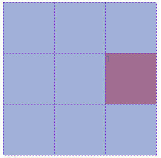
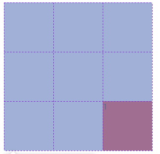
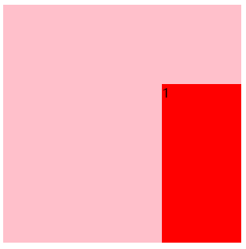
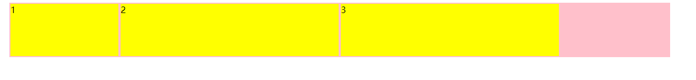

你最好告诉我怎么把元素放到划好的格子里

## 根据栅格线放置元素到指定的格子

```css
 #gird {
            background-color: pink;
            display: grid;
            height: 300px;
            width: 300px;;
            grid-template-columns: repeat(3,1fr);
            grid-template-rows: repeat(3,1fr);

        }
 div:nth-child(1){
            background-color: red;
     		//第二行开始
            grid-row-start: 2;
     		//第三行开始
            grid-row-end: 3;
     		//第三列开始
            grid-column-start: 3;
     		//第三列结束
            grid-column-end: 4;
        }
```



## 为栅格命名放置元素

```css
  #gird {
            background-color: pink;
            display: grid;
            height: 300px;
            width: 300px;;
            grid-template-columns: [c1 c2]100px [c3 c4]100px [c5 c6]100px;
            grid-template-rows: [r1 r2]100px [r3 r4]100px [r5 r6]100px;

        }
        div:nth-child(1){
            background-color: red;
            grid-row-start: r5;
            grid-row-end: r6;
            grid-column-start: c5;
            grid-column-end: c6;
        }
```

> c1代表列左侧线 c2代表列的右侧线 以此类推
>
> r1 代表第一个行的顶线 r2 代表第一个行的尾线
>
> 和上一个功能唯一的区别就是自定义名字



## 重复栅格放置元素

```css
grid-template-columns: repeat(3,[c-start]100px[c-end]);
grid-template-rows: repeat(3,[r-start]100px[r-end]);
/**/
grid-row-start:r-start 2;
grid-row-end:r-end 3
grid-column-start:c-start 3;
grid-column-end:c-end 3
```



## 根据偏移量定位元素

```CSS
grid-row-start: 2;
grid-row-end: span 2;
grid-column-start: 2;
grid-column-end: span 2;
```

> span代表跨几个格子


## 元素定位简写操作

```css
 grid-row:2/span 2;
 grid-column:2 / span 2
```

> 通过 `/`来实现分割 和上面效果是一样的

## 实现简易的栅格系统

```html
<!DOCTYPE html>
<html lang="en">
<head>
    <meta charset="UTF-8">
    <meta name="viewport" content="width=device-width, initial-scale=1.0">
    <title>Document</title>
    <style>
        .header{
            width: 1200px;
            height: 100px;
            margin: 0 auto;
            background: pink;
        }
        .row {
            height: 100%;
            display: grid;
            grid-template-columns: repeat(12,1fr);
        }
        .col-1{
            grid-column-end: span 1;
        } .col-2{
            grid-column-end: span 2;
        } .col-3{
            grid-column-end: span 3;
        } .col-4{
            grid-column-end: span 4;
        }
          [class^='col']{
            background: yellow;
              box-sizing: border-box;
              padding: 2px;
              background-clip: content-box;
        }
    </style>
</head>
<body>
    <div class="header">
        <div class="row">
            <div class="col-2">1</div>
            <div class="col-4">2</div>
            <div class="col-4">3</div>
        </div>
    </div>
</body>
</html>

```



> 核心css就是 grid-column-end