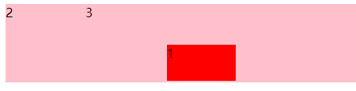
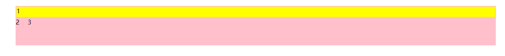
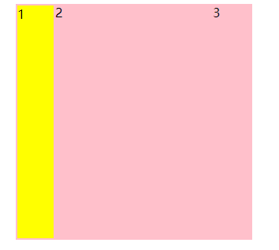

我跟你说过了,只会降龙十八掌可不行

## 使用区域部署元素定位

可以通过`grid-area` css属性进行定位

格式:`行开始/列开始/行结束/列结束`

```css
 grid-area: 2/3/3/4;
 /* 
   第二行开始/第三列开始/第三方结束/第四列结束
*/
```



> 我感觉要是 按这个方式用 grid-area 这个属性 真是太无聊了 

## 区域命名部署元素

在使用区域部署元素定位的时候 我们可以给区域进行命名 来确定元素到底放在哪个格子

`grid-template-areas` 对区域进行命名

```css
.row {
        height: 100%;
        display: grid;
        grid-template-columns: 30px 1fr;
        grid-template-rows:30px 1fr 30px;
         /*进行区域命名 一个引号代表一行 里面的内容代表每一个格子*/
        grid-template-areas: "header header" "nav main" "fotter fotter";
}
.row > div:nth-child(1){
        background: yellow;
        box-sizing: border-box;
        padding: 2px;
        background-clip: content-box;
        /*把第一个格子放在header中*/
        grid-area: header;
      }
```

> 相邻的两个格子可以起一样的名字 在放置元素的时候会实现跨列的效果



## 区域命名线部署元素

在我们使用`grid-template-areas`设置区域名字的时候 会自动给每个格子设置线

```css
grid-template-areas: "header header" "nav main" "fotter fotter";
```


比如说 `nav`  这个格子就会自动出现4条线 

行:`nav-start` `nav-end` 

列:`nav-start` `nav-end`

```css
grid-area: header-start/header-start/fotter-end/nav-end;
```



> 说白了就是通过4条边确定格子的位置 感觉和那个grid-row-start一个意思

## 区域占位符号

```css
grid-template-areas: ". ." ". ." "fotter fotter";
```

有时候我们划分的栅格恰巧够用 或者我们只是需要用到`fotter`区域 其他的区域完全用不上 我们就可以使用占位符号进行占位 不需要起名字
