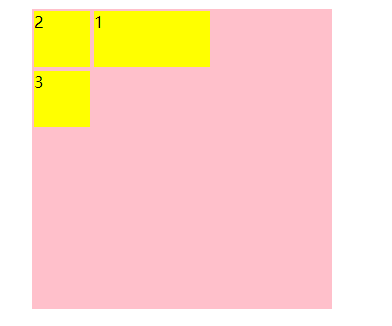
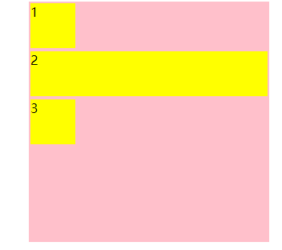
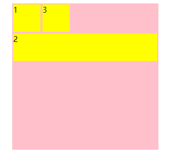
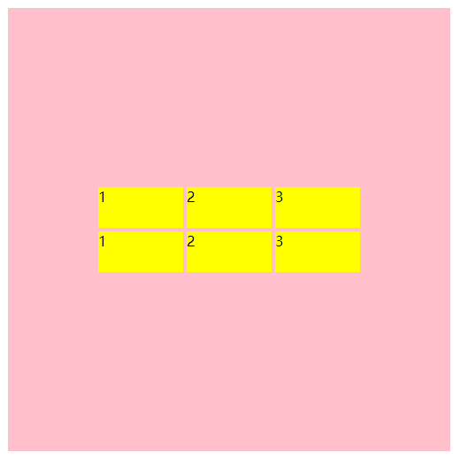
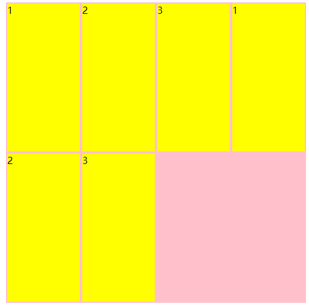
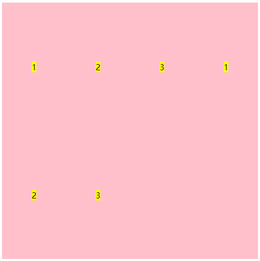
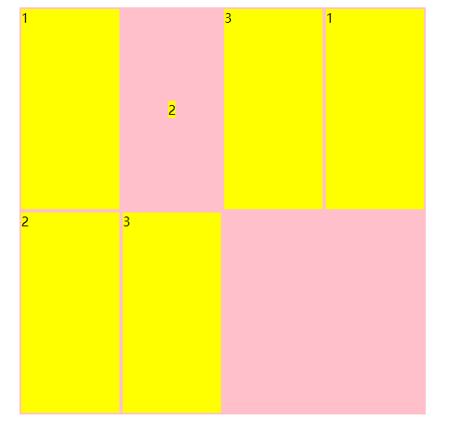

你给我这辆车没方向盘 我可控制不了方向

## 栅格流动方向

默认我们的流动方向是 **从左到右** **从上到下**

我们可以使用一个属性 改变它的流动方向

```css
.row {
            height: 100%;
            display: grid;
            grid-template-columns: repeat(5,1fr);
            grid-template-rows: repeat(5,1fr);
            grid-auto-flow: column;
        }
.row > div:nth-child(1){
           
            grid-column: 2/span 2; 
      }
```

我们可以使用 `grid-auto-flow` 把grid修改为纵向流动




> 可以看到 2和3不再向右流动 开始向下流动

## 空间自动填满

```css
.row {
            height: 100%;
            display: grid;
            grid-template-columns: repeat(5,1fr);
            grid-template-rows: repeat(5,1fr);
            grid-auto-flow: row ;
        }
      .row > div:nth-child(2){
           
            grid-column: 1/span 5; 
      }
```



因为 第二个元素需要`span5个`网格 但是第一行放不下 直接跑到了第二行 导致第一个格子右边出现了未使用的空网格 这时候我可以使用 `dense`填满没使用的网格

```css
.row {
            height: 100%;
            display: grid;
            grid-template-columns: repeat(5,1fr);
            grid-template-rows: repeat(5,1fr);
            grid-auto-flow: row dense;
        }
      .row > div:nth-child(2){
           
            grid-column: 1/span 5; 
      }
```



>  可以看到3自动跑到上面去了

## 栅格整体的对齐方式

当网格的宽度和高度都小于整个容器 可以使用 `justify-content` 或者 `align-content` 来控制容器内网格的位置

```css
  .header{
            height: 500px;
            width: 500px;
            margin: 0 auto;
            background: pink;
        }
        .row {
            height: 100%;
            display: grid;
            grid-template-columns: repeat(3,100px);
            align-content: center;
           justify-content: center;
            /* grid-template-rows: repeat(5,1fr);
            grid-auto-flow: row dense; */
        }
```

外边容器宽度为 宽高都为 500px 但是我只有三列 每列100px 



## 栅格内网格的对齐方式

在我们正常使用栅格布局的时候 网格里面的元素不给宽高 默认是撑满的



如图所示 我并没有给网格里面的元素设置宽高

我们可以使用`justify-items` 设置水平轴的位置

垂直使用 `align-items`设置

```css
 .header{
            height: 500px;
            width: 500px;
            margin: 0 auto;
            background: pink;
        }
        .row {
            height: 100%;
            display: grid;
            grid-template-columns: repeat(4,1fr);
            justify-items: center;
            align-items: center;
            /* grid-template-rows: repeat(5,1fr);
            grid-auto-flow: row dense; */
        }
```



设置网格内的元素全部居中显示

## 单独对某个网格进行控制

假如我并不想对所有网格进行控制 只是想控制某1个格子 可以使用 `align-self` 或者`justify-self`来进行控制

```css
      .row {
            height: 100%;
            display: grid;
            grid-template-columns: repeat(4,1fr);
            /* justify-items: center;
            align-items: center; */
            /* grid-template-rows: repeat(5,1fr);
            grid-auto-flow: row dense; */
        }
      .row > div:nth-child(2){
           align-self: center;
           justify-self: center;
         
      }
```



在上面的例子中 我们仅仅对第二个格子做了对齐的操作