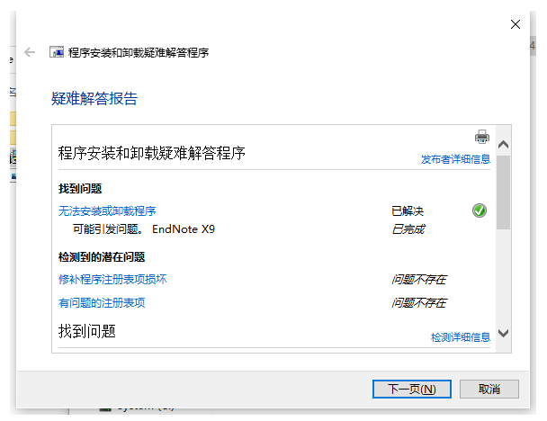

⚽️

## 一、在安装或者卸载软件时遇到 trying to use is on a network resource that is unavailable 怎么办？

`The feature you are trying to use is on a network resource is unavailable`

点击 `ok` 之后会有 Click OK to try again, or enter an alternate path to afolder containing the installation package [EndNote](https://so.csdn.net/so/search?q=EndNote&spm=1001.2101.3001.7020) x9v19.0.0.12062 Setup(1).msi' in the box below.

具体如下图所示：

博主花费一早上的时间终于解决这个问题，主要是由于您试图使用的安装或卸载文件已损坏或不完整，这可能是由第三方系统软件升级或恶意病毒入侵导致。这就是使用破解软件的弊端！！！

## 二、解决方法如下：

1.  在安装包上右键->以管理员身份运行就行了。如果没有管理员身份运行这个选项，则使用下面 2；
2.  微软官方的修复工具连接：[https://support.microsoft.com/zh-cn/help/890830/remove-specific-prevalent-malware-with-windows-malicious-software-remo](https://link.zhihu.com/?target=https%3A//support.microsoft.com/zh-cn/help/890830/remove-specific-prevalent-malware-with-windows-malicious-software-remo) 但是我打不开，看有没有有缘人能打开，我从这个网站

[Microsoft Program Install and Uninstall 官方电脑版\_华军纯净下载 (onlinedown.net)](http://soft.onlinedown.net/soft/1224962.htm)

上面下载一个 Microsoft Program Install and Uninstall 工具很好用

下载之后直接运行，查找程序安装和卸载疑难解答程序，如图

找到自己想要修复解决的软件，我的是解决 endnote,如图

然后就可以进行你的安装或者卸载啦~

## 三、总结

已解决
